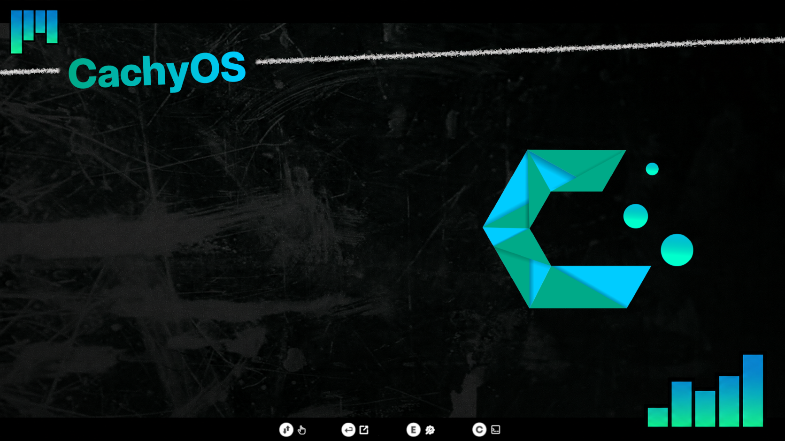

# Dark Matter GRUB Theme — CachyOS

A CachyOS variant of the [Dark Matter GRUB Theme](https://github.com/VandalByte/darkmatter-grub2-theme) by VandalByte.

The original theme supports many distros but had no CachyOS version, so I made one — custom background and CachyOS logo included.



---

## Installation

```bash
git clone https://github.com/croaky-fx/darkmatter-grub-theme-cachyos
cd darkmatter-grub-theme-cachyos
sudo python3 darkmatter-theme.py --install
```

Then update GRUB:

```bash
sudo grub-mkconfig -o /boot/grub/grub.cfg
```

---

## Manual Installation

```bash
sudo cp -r darkmatter /usr/share/grub/themes/
```

Edit `/etc/default/grub`:

```
GRUB_THEME="/usr/share/grub/themes/darkmatter/theme.txt"
```

Update GRUB:

```bash
sudo grub-mkconfig -o /boot/grub/grub.cfg
```

> **Note for CachyOS users:** the theme path may be `/usr/share/grub/themes/` or `/boot/grub/themes/` depending on your setup. Check which one your system uses:
> ```bash
> cat /etc/default/grub | grep GRUB_THEME
> ```

---

## Uninstall

```bash
sudo python3 darkmatter-theme.py --uninstall
```

---

## Credits

- Original theme by [VandalByte](https://github.com/VandalByte/darkmatter-grub2-theme)
- CachyOS variant by [croaky-fx](https://github.com/croaky-fx)
