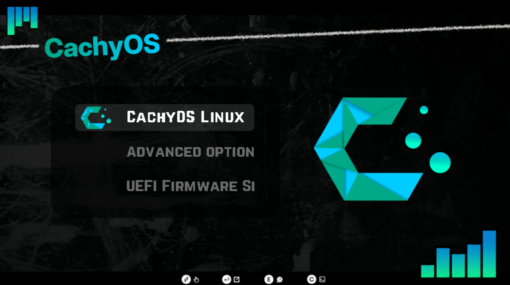

# Dark Matter GRUB Theme — CachyOS

A CachyOS variant of the [Dark Matter GRUB Theme](https://github.com/VandalByte/darkmatter-grub2-theme) by VandalByte.
The original theme supports many distros but had no CachyOS version, so I made one — custom background and CachyOS logo included.



---

## Requirements

- Python 3.x
- `git`
- GRUB 2 (package: `grub`)

---

## Installation

```bash
git clone https://github.com/croaky-fx/darkmatter-grub-theme-cachyos
cd darkmatter-grub-theme-cachyos
sudo python3 darkmatter-theme.py --install
```

> The script automatically updates GRUB after installing — no need to run `grub-mkconfig` manually.

---

## Manual Installation

```bash
sudo cp -r darkmatter /boot/grub/themes/
```

Edit `/etc/default/grub`:

```
GRUB_THEME="/boot/grub/themes/darkmatter/theme.txt"
```

Then update GRUB:

```bash
sudo grub-mkconfig -o /boot/grub/grub.cfg
```

> **Note for CachyOS users:** the correct theme path is `/boot/grub/themes/`.
> You can verify your current theme setting with:
> ```bash
> grep GRUB_THEME /etc/default/grub
> ```

> **Note for Fedora/RHEL users:** the script sets `GRUB_ENABLE_BLSCFG=false` in `/etc/default/grub` automatically, which is required for GRUB themes to work on BLS-based systems.

---

## Uninstall

```bash
sudo python3 darkmatter-theme.py --uninstall
```

---

## Credits

- Original theme by [VandalByte](https://github.com/VandalByte/darkmatter-grub2-theme)
- CachyOS variant by [croaky-fx](https://github.com/croaky-fx)
